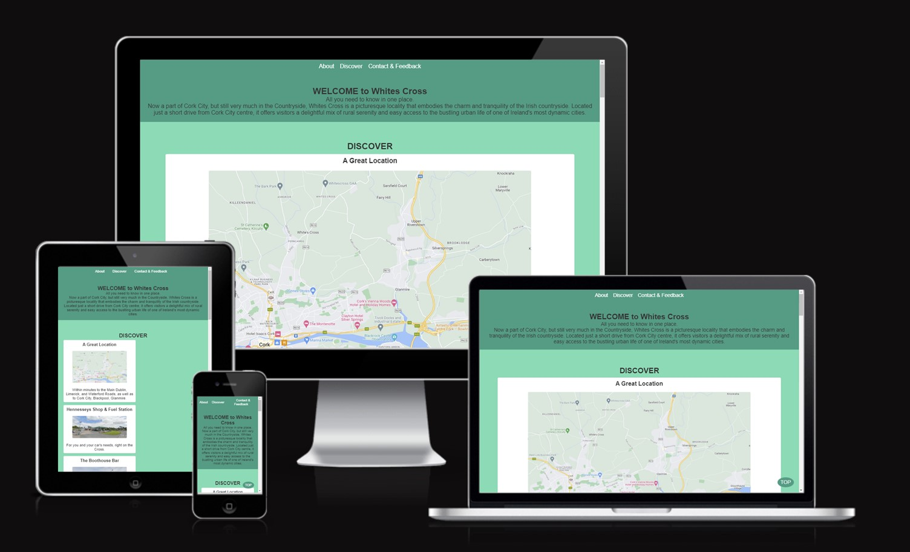
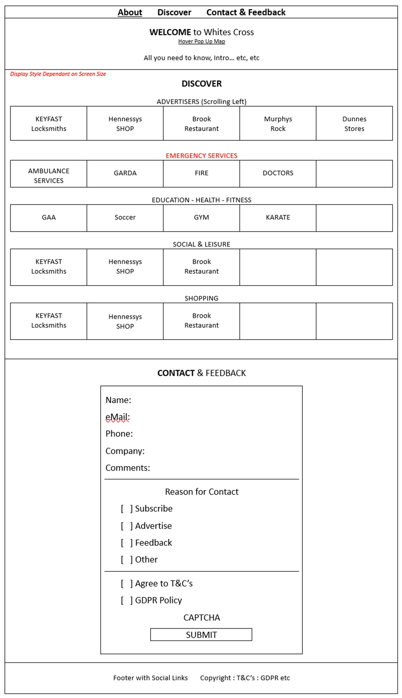

# Whites Cross, Cork, Ireland

## Introduction

This website celebrates the heritage, culture, and significance of Whites Cross. It serves as a primary hub to find, post, or advertise (free of charge) information related to events, stories, or offerings connected to Whites Cross and its neighbouring areas.

### Portfolio Project 1 – Sean Kirwan

## Project Repository

Live Site

Table of contents

1.	UX
2.	Features
3.	Technology Used
4.	Accessibility Features
5.	Testing
6.	Deployment
7.	Credits
8.	Acknowledgements

### UX

Strategy for "Whites Cross" Website
The "Whites Cross" website was built to celebrate and preserve the rich heritage, culture, and significance of Whites Cross. Our main strategy revolves around establishing the website as the primary hub for locals and visitors alike, serving as their first port of call for any information, events, or activities related to Whites Cross and its neighbouring areas.

While also providing historical information, the main aim is to spotlight current happenings and future prospects in Whites Cross, and surrounding areas. Local enthusiasts, event organisers, and businesses have a platform where they can post and advertise (at no cost) activities, stories, or offerings connected to the area.

Going forward, the site will offer an all-encompassing guide that immerses visitors in the very essence of Whites Cross. It will bridge the past with the present, as it moves from being a County Area to a City Suburb, ensuring the continuation and appreciation of Whites Cross's storied legacy.

## User Stories for "Whites Cross" Website

### Users:
• I want to learn about the history of Whites Cross.
• I want to be kept abreast of current events, historical tidbits, and future prospects related to Whites Cross.
• I wish to post or advertise events, services, or offerings related to Whites Cross for free.
• I seek an authoritative source that offers a panoramic view of Whites Cross and its surroundings.
• I'm curious about the significance of Whites Cross in a broader context.
• I intend to use this as my primary source of information before visiting or organising events in the area.

### Site Owner:
• I aim to champion and keep alive the rich cultural tapestry of Whites Cross.
• I wish to foster a community spirit by allowing free postings and advertisements related to the area.
• I aspire to make the website a comprehensive and trusted source of information for anything related to Whites Cross.
• I want to seamlessly integrate the history, current events, and future potentials of Whites Cross, ensuring its significance is forever etched in the hearts of visitors.

Scope for "Whites Cross" Website
The website will:

• Offer consistent navigation throughout the site, ensuring user-friendliness.
• Showcase a comprehensive guide that connects visitors with the heritage, culture, and significance of Whites Cross.
• Feature links to associated activities, events, and local businesses around Whites Cross.
• Dive deep into the rich history of Whites Cross.
• Include a sign-up form for newsletters, accentuated with a compelling call-to-action button.
• Embed interactive tools for real-time weather updates and mapping insights for Whites Cross and its vicinity.
• Offer clear and concise directions to Whites Cross and highlighted attractions.
• Integrate links to our active social media platforms to foster community engagement.
• Display high-resolution images capturing the essence and beauty of Whites Cross.
• Ensure that all content is adaptive and responsive across various devices, offering a seamless browsing experience.

Structure

Home Page

• Header Bar: with intuitive navigation links to "Discover" and "Contact".
• Hero Image: Is a Map showing Whites Cross proximity to Local Amenities etc.
• Heart of Whites Cross Section: Illustrating images coupled with insights about the heritage, culture, and significance of the location.
• Footer: Integrated links to active social media platforms, connecting visitors to the broader Whites Cross community.

Discover Page

• Header Bar: Providing seamless navigation to "About" and "Contact".
• Gallery: A curated selection of images combined with engaging narratives.
• Live updates: What’s on, weather etc, customised for the Whites Cross vicinity to keep visitors informed.
• Footer: Quick links to social media platforms, for visitors to further explore Whites Cross stories and engagements.

Contact Page

• Get in Touch Section: Details and forms for visitors to reach out, inquire, or provide feedback.
• Location Insights: Integration of a Google Map iframe showing Whites Cross.
• Footer: Direct links to all active social media platforms, fostering deeper community ties and interactions.

Wire Diagram
PP1 “Whites Cross” Wire Diagram

Surface
Aim is to create a Country Blending with The City Theme.

Background color
•	Primary Background uses #449c83, Light Green (Whites Cross GAA Colours).
•	Secondary Background uses #7bdcb5, a Slightly Darker Green

Font color
•	Primary Font uses #333, Black.
•	Secondary Font uses #fff, White (Whites Cross GAA Colours)

Fonts
•	Arial, Sans-serif.

Features

Existing Features

•	Nav Bar

The Heading section consists of a Navigation Bar with 3 links. The Header uses a flex box to align and keep the 3 links equally spaced.

•	Hero Image Section

The Hero image is a Map showing Whites Cross proximity to Cork City, as well as to the Main Roads to Dublin, Limerick and Waterford, and also to Cork City, Blackpool, Glanmire.

•	Discover Section

The Discover Section consists of Photos, Videos, Links, News, Advertisements of, or for Anything to do with Whites Cross. The section flex box switches to column direction and the images size adjusts down at smaller screen sizes. All images have alt text labels to aid accessibility.

•	Contact Section

This section, via a simple multi-use signup form, provides a means for users to Subscribe to any forthcoming Community newsletters, and/or for Advertisers to provide their details (Special Offers etc), and/or to provide Feedback (Ideas, Suggestions etc), and/or any other non specified reason, such as a complaint.

Certain Calls are Mandatory, others require at least one off a set (ie either Phone or eMail) to be populated.

There is a CAPTCHA to prevent Bot Abuse etc, and Users MUST Accept T&C’s and GDPR & Cookie Policy before SUBMIT is possible.

•	Footer

Contains a Navigation Bar with &copy, and external links to social media sites.
All external links have aria labels to aid accessibility and open a separate window/tab.

Future Features
I intended implementing following features immediately, but simply did not have time within deadlines, so hope to complete them in the next few months.

1: News & Info Section - Post reports and images from recent events etc.

2: Events Calendar – For local Business, Sports clubs etc could place Ad’s, post upcoming events

3: ERROR 404 Page - Direct user to the Home Page if they end up on a broken link

Technology Used
Html
Used to structure my webpages.
CSS
Used to provide style, layout and responsiveness to my website.

Accessibility Features
•	All images have alt labels
•	Any links that take user to external website have aria labels
•	Care has been taken to ensure good contrast between text and back ground colors
•	Have used semantic html throughout

Testing
•	Functional testing
Test	Outcome
All navigation links take user to correct page	pass
All external links open new, correct page	pass
Content reformats on smaller screens	pass
Contact & Feedback Form submits correctly	Pass
Contact & Feedback Form prevents wrong data types	pass

•	User testing

Family Members and Friends tested the following…
•	Spelling, grammar and general readability of content.
•	Content responsive to different screen sizes.
•	All links work.
•	Form works.

I also sought help & support from Code Institute Cohort Facilitator, Alan Bushell, as well as from Mentors, Aleksei Konovalov and Brian Macharia, all of whom I found were really helpful and worthwhile. THANKS VERY MUCH

Bugs found and fixed
There were a number of bugs (or issues) that I found very frustrating. Pretty sure the vast majority were down to my inexperience, forgetting to send code to git, and then losing it all.

One that totally baffled me in the CodeAnywhere IDE was the constant issues with CCS Code not responding as I’d expected. Even after setting up another CSS Folder to feed from, it still did not resolve.

Bugs found and NOT fixed
It is now 22.00 Hrs so just 2 Hrs to Complete & Present.

Even though it did not happen on my Tablet,

I note image shows left justification

I’ll need have a look again at this

Code and CSS validators

The FULL Site has passed W3C HTML and CSS validators with no errors or warnings.

W3C HTML Validator

W3C CSS Validator

The Site was Tested with Google Lighthouse with the following results.

Note: I will Convert all images from png/jpeg to either AVIF or WebP as a result of this testing so as to improve performance.

Deployment
To deploy this page to GitHub Pages from its GitHub repository, the following steps were taken:

1.	Log into GitHub.
2.	From the list of repositories on the screen, select steve-doc/40-foot.
3.	From the menu items near the top of the page, select Settings.
4.	Scroll down to the GitHub Pages section.
5.	Under Source click the drop-down menu labelled None and select Master Branch
6.	On selecting Master Branch the page is automatically refreshed, the website is now deployed.
7.	Scroll back down to the GitHub Pages section to retrieve the link to the deployed website.
At the moment of submitting this Milestone project the Development Branch and Master Branch are identical.

How to run this project locally
To clone this project into Gitpod you will need:

1.	A Github account. Create a Github account here
2.	Use the Chrome browser

Then follow these steps:

1.	Install the Gitpod Browser Extentions for Chrome
2.	After installation, restart the browser
3.	Log into Gitpod with your gitpod account.
4.	Navigate to the Project GitHub repository
5.	Click the green "Gitpod" button in the top right corner of the repository
6.	This will trigger a new gitpod workspace to be created from the code in github where you can work locally.

To work on the project code within a local IDE such as VSCode, Pycharm etc:

1.	Follow this link to the Project GitHub repository.
2.	Under the repository name, click "Clone or download".
3.	In the Clone with HTTPs section, copy the clone URL for the repository.
4.	In your local IDE open the terminal.
5.	Change the current working directory to the location where you want the cloned directory to be made.
6.	Type git clone, and then paste the URL you copied in Step 3.
git clone <https://github.com/USERNAME/REPOSITORY>
7.	Press Enter. Your local clone will be created.
Further reading and troubleshooting on cloning a repository from GitHub here.

Credits

Code

1.	The Deployment method within README.md was adapted from Stephen Docherty README.md <https://github.com/steve-doc/40-foot/blob/main/README.md>

Content

Whites Cross GAA Section quotes White's Cross GAA - Wikipedia

Media
Credit for image sources

Images : Google Maps Streetview, for all images

Video : YouTube, for White Cross GAA Video <https://youtu.be/a6SMbMjdDTE?feature=shared>

Link : CARS.ie for External Link from Boothouse Bar <https://www.CARS.ie>

Acknowledgements
•	Mentor - Brian Macharia
•	Cohort Facilitator - Alan Bushell

Both really Knowledgeable, Pleasant & Patient, who gave great support and tips

